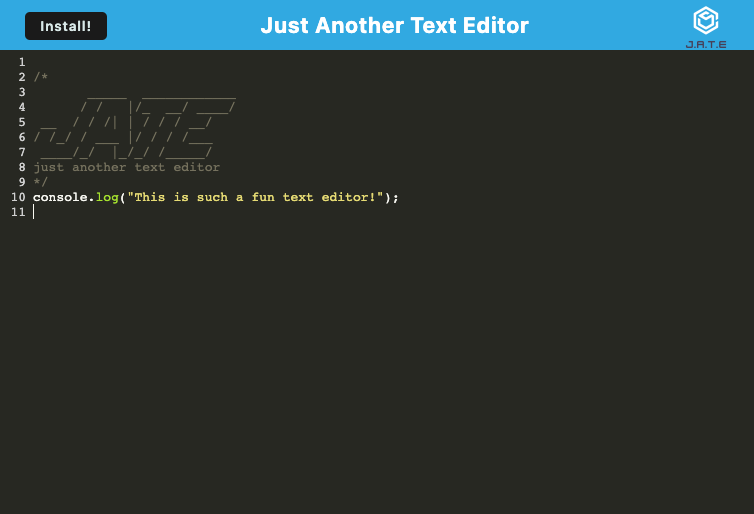

# PWA Text Editor
## Description
This is Just Another Text Editor (JATE). The purpose of this app is to store code snippets whenever the occasion arises where a programmer needs to store or revisit a code snippet. Off or online the user can view or add to their text editor. Another fun addition to this text editor is it follows the color changing patterns that a code editor application would use. JATE uses a handful of different packages to get all this functionality. These packages include  Babel, Workbox, CodeMirror, and IndexedDB. 
## Installation
To run this application locally, you must clone this repository to your local computer. then run `npm install` to gain the necessary dependencies. Then to build and start the server, run `npm run start:dev`. This command uses the concurrently npm package which essentially allows multiple commands to run concurrently.
## Usage
The common uses of this app are:
1. Write and edit code snippets for a user to reference at a later time.
2. Have this data stored using IndexedDB
3. Have this data persist even when the user is offline.
4. Install the app as an application for easy access.
## Technologies
- [Babel](https://babeljs.io/)
- [Webpack](https://webpack.js.org/)
- [CodeMirror](https://codemirror.net/)
- [IndexedDb](https://www.npmjs.com/package/idb)
- [Workbox](https://www.npmjs.com/package/workbox-webpack-plugin)
### Resources
- [Deployed App](https://another-text-editor-040923-3c59dc8eb62b.herokuapp.com/)
- [Github Repo](https://github.com/cdgonzo23/pwa-text-editor)
